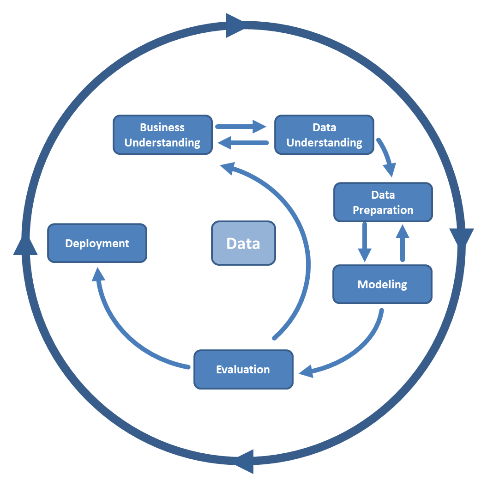

# UC Berkeley | Professional Certificate in Machine Learning and Artificial Intelligence


<table cellspacing="0" cellpadding="0" border="0" style="border-collapse: collapse;">
  <tr>
    <td valign="top" width="60%">
      <h2>Overview: Module 11 - Practical Application 2</h2>
      <h3>"What Drives the Price of a Car?"</h3>
      <p>
        In this practical application, we will be leveraging a dataset 
        from <b>Kaggle</b> to predict "what factors make a car more or less expensive".
        Working within the <b>CRISP-DM</b> framework, we will be going through the following steps:
        <ul>
          <li>Business Understanding</li>
          <li>Data Understanding</li>
          <li>Data Preparation</li>
          <li>Modeling</li>
          <li>Evaluation</li>
          <li>Deployment</li>
        </ul>
      </p>
    </td>
    <td valign="top">
      
    </td>
  </tr>
</table>

## Features
- Answer the question, "What Drives the Price of a Car?"
- Use data visualization / various models and evaulation metrics to be able to provide recommendations to a car dealership what the customer values most


## Project Structure

```
uc-berkeley-ml-ai/
│-- ai-env/          # Virtual environment (ignored in Git)
|-- module-11/
  |-- assets/          # Stores images, icons, logos, etc
  |-- data/            # Sample data like CSV files
  │-- notebooks/       # Jupyter notebooks 
  │-- README.md        # Project description  
│-- .gitignore         # Ignore ai-env/ and other unnecessary files
│-- LICENSE            # Open-source license
│-- README.md          # Program description
│-- requirements.txt   # Dependencies file
```

- the Jupyter Source File (car_features.ipynb) will be housed in the **notebooks** folder 
- and the CSV file (vehicles.csv) stored in the **data** folder


## Tech Stack

**Libraries:**  
Pandas, Seaborn, Matplotlib, NumPy, Missingno, scikit-learn

**Models Used:**  
Linear Regression, Lasso, Ridge, SVR, KNN, Random Forest, XGBoost


## Installation & Setup
'''bash 

1) git clone https://github.com/edmundllee/uc-berkeley-ml-ai

2) navigate to project root 

3) install dependencies 

4) run notebook/application

5) for notebooks, there is the additional step of selecting the specific Jupyter file to open


'''bash

```
> git clone https://github.com/edmundllee/uc-berkeley-ml-ai
> cd UC-BERKELEY-ML-AI/notebooks/
> pip install -r requirements.txt
> jupyter notebook
```

once jupyter notebook is open you should be able to select the [notebook/car_features.ipynb](https://github.com/edmundllee/uc-berkeley-ml-ai/blob/main/module-11/notebooks/car_features.ipynb)


## Findings & Insights

### Key Trends

1. **New Cars & Low Mileage Garner Higher Prices**  
   Buyers show strong preference for cars with fewer miles and more recent model years due to better reliability and lower maintenance costs.

2. **Top Manufacturers Retain Higher Value**  
   Brands known for performance and dependability (Toyota, BMW, Honda) consistently receive higher resale values.

3. **Automatic Transmission Increases Price**  
   Cars with automatic transmissions usually are more expensive, reflecting consumer preference and driving ease.

---

### Important Features Driving Price

| Feature            | Insight                                                                 |
|--------------------|-------------------------------------------------------------------------|
| **Year**           | Newer cars usually depreciate less and sell for higher prices.          |
| **Odometer**       | Lower mileage strongly correlates with a higher resale value.           |
| **Manufacturer**   | Top brands are associated with greater market value.                    |
| **Transmission**   | Automatics cars tend to be priced higher than manual cars.              |


## Actionable items

* Segment audience

* Optimize coupon timing

* Refine marketing channels

* Continue to monitor


## Next steps & recommendations

* Conduct a time-based trend analysis

* Explore cluster analysis to segment buyer behavior

* Deploy the model to price inventory in real time


