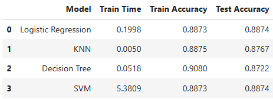

# UC Berkeley | Professional Certificate in Machine Learning and Artificial Intelligence

<table cellspacing="0" cellpadding="0" border="0" style="border-collapse: collapse;">
  <tr>
    <td valign="top" width="60%">
      <h2>Overview: Module 17: Practical Application 3</h2>
      <h3>"Comparing Classifiers?"</h3>
      <p>
        In this third practical application assignment, our goal is to compare the performance of the classifiers (k-nearest neighbors, logistic regression, decision trees, and support vector machines) we've encountered in this section of the program. We will use a dataset related to the marketing of bank products over the telephone.
      </p>
      <p>
        We will be covering the following: 
        <ul>
          <li>Overview and Getting Started</li>
          <li>Data Understanding and Preparation</li>
          <li>Feature Engineering</li>
          <li>Training and Modeling</li>
          <li>Scoring and Comparing the Model</li>
          <li>Improving the Model</li>
        </ul>
      </p>
    </td>
    <td valign="center">
      
    </td>
  </tr>
</table>

## Features
- Compare the performance of the classifiers (k-nearest neighbors, logistic regression, decision trees, and support vector machines)
- The dataset you will use comes from the UC Irvine Machine Learning Repository Links to an external site.. The data is from a Portuguese banking institution and is a collection of the results of multiple marketing campaigns.
- Use data visualization / machine learning models 


## Project Structure

```
uc-berkeley-ml-ai/
│-- ai-env/                           # Virtual environment (ignored in Git)
|-- module-17/  
  |-- assets/                         # Stores images, icons, logos, etc
  |-- data/                           # Sample data like CSV files
  │-- notebooks/                      # Jupyter notebooks 
    |-- classifier_comparison.ipynb
    │-- README.md                     # Project description
  │-- .gitignore                      # Ignore ai-env/ and other unnecessary files
│-- LICENSE                           # Open-source license
│-- README.md                         # Program description
│-- requirements.txt                  # Dependencies file
```

- the Jupyter Source File (classifier_comparison.ipynb) will be housed in the **notebooks** folder 
- and the CSV File (coupon_data.csv) stored in the **data** folder


## Tech Stack

**Libraries:**  
Pandas, Seaborn, Matplotlib, NumPy, scikit-learn

**Models Used:**  
k-nearest neighbors, logistic regression, decision trees, and support vector machines


## Installation & Setup
'''bash 

1) git clone https://github.com/edmundllee/uc-berkeley-ml-ai

2) navigate to project root 

3) install dependencies 

4) run notebook/application

5) for notebooks, there is the additional step of selecting the specific Jupyter file to open


'''bash

```
> git clone https://github.com/edmundllee/uc-berkeley-ml-ai
> cd UC-BERKELEY-ML-AI/notebooks/
> pip install -r requirements.txt
> jupyter notebook
```

once jupyter notebook is open you should be able to select the [notebook/classifier_comparison.ipynb](https://github.com/edmundllee/uc-berkeley-ml-ai/blob/main/module-17/notebooks/classifier_comparison.ipynb)


## Findings & Insights

* The dataset was significantly imbalanced effecting both precision and recall

* Logistic Regression and SVM had the highest accuracy (~88.73%)

* Simple models (logistic regression) sometimes work best


## Actionable items

* Improve imbalance 

* Augment feature engineering

* Test other models 


## Next steps & recommendations

* Target campaigns to groups more likely to subsribe like students


