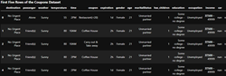
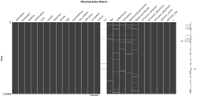
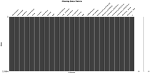
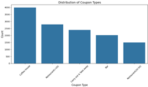

# UC Berkeley | Professional Certificate in Machine Learning and Artificial Intelligence

## Module 5: Practical Application 1
**"Will a customer accept the coupon?"** 


<table cellspacing="0" cellpadding="0" border="0" style="border-collapse: collapse;">
  <tr>
    <td style="border: none;"></td>
    <td style="border: none;"></td>
    <td style="border: none;">
      
      
    </td>    
    <td style="border: none;"></td>
  </tr>
</table>

## Features
- Answer the question, "Will a customer accept the coupon?"
- Use data visualization / probability distribution to distinguish between customers who will accept the coupon versus those who did not


## Project Structure

```
uc-berkeley-ml-ai/
│-- ai-env/          # Virtual environment (ignored in Git)
|-- module-5/
  |-- assets/          # Stores images, icons, logos, etc
  |-- data/            # Sample data like CSV files
  │-- notebooks/       # Jupyter notebooks 
    |-- coupon_prompt.ipynb
  │-- .gitignore       # Ignore ai-env/ and other unnecessary files
  │-- LICENSE          # Open-source license
  │-- README.md        # Project description
  │-- requirements.txt # Dependencies file
```

- the Jupyter Source File (coupon_prompt.ipynb) will be housed in the **notebooks** folder 
- and the CSV File (coupon_data.csv) stored in the **data** folder


## Tech Stack
- Pandas
- Matplotlib
- Seaborn
- Numpy
- Missingno


## Installation & Setup
'''bash 

1) git clone https://github.com/edmundllee/uc-berkeley-ml-ai

2) navigate to project root 

3) install dependencies 

4) run notebook/application

5) for notebooks, there is the additional step of selecting the specific Jupyter file to open


'''bash

```
> git clone https://github.com/edmundllee/uc-berkeley-ml-ai
> cd UC-BERKELEY-ML-AI/notebooks/
> pip install -r requirements.txt
> jupyter notebook
```

once jupyter notebook is open you should be able to select the [notebook/coupon_prompt.ipynb](https://github.com/edmundllee/uc-berkeley-ml-ai/blob/main/module-5/notebooks/coupon_prompt.ipynb)


## Findings & Insights

* Frequent bar-goers over 25 are less likely to accept the bar coupon

* Younger Drivers Are More Likely to Accept Bar Coupons*

* Passengers Impact Coupon Acceptance

* Income and Spending Habits Matter


## Actionable items

* Segment audience

* Optimize coupon timing

* Refine marketing channels

* Continue to monitor


## Next steps & recommendations

* Deepen data exploration & feature engineering

* Develop predictive models

* A/B Testing 

* Create an interactive dashboard

* Documenation & Reports


